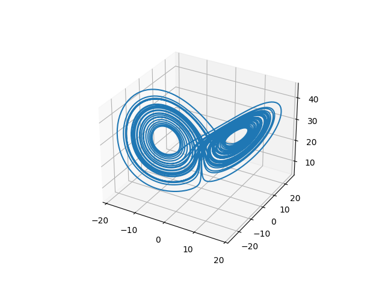

## 1. Machine Learning and Dynamical Systems: Supervised Learning

Building on the problem statement presented  [@nateghi2022] and [@Champion_2019], we assume a causal, deterministic system underlying a set of noisy, high-dimensional observations.

We are interested in solving a supervised learning problem, given a scalar field to be best fitted, in a mean squared error sense, using the observed features in time. This is a common problem statement in the machine learning literature. In order for claims associated with such works to be scientific, i.e., falsifiable [@Prado_2022], [@Popper63], it is necessary to attach to publications not only the source code written in the context of the work, but also data and outputs.

We enable this using an [IPFS](https://ipfs.io/) node, and including all the necessary CIDs into the source code.
In this way it is also possible to save trained machine learning models.

## 2. Convex Optimization

This enables incremental works: assume one is interested in making use of the trained machine learning models in order to integrate it into a more complex pipeline. As an example, we use the trained model to estimate targets and use them as an input to a convex optimizer [@cvxpy].

## 3. Chaos

Following the methodology discussed in [@ManziPisaJulia], it is possible to use the tools of chaos theory in order to investigate the existance of coherent structures in the underlying dynamical system [@FROYLAND20091507]. As we are interested in exploring bifucating phenomena of such structures in a two-dimensional space, an animation can be used to do this. The use of IPFS enables the integration of multimedia contents like [this](https://gateway.crunchdao.com/ipfs/QmRPq1NZWCsTgrfZNVQpFohbgk2hvxGZE6oV6fexeqK5Px) or [this](https://gateway.crunchdao.com/ipfs/QmfHvrhiKam8Q9b46qTBtexsu8BpTdMsUpKL6AhEXtc3AD) in this work, accessible both from the paper and from the source code.

# References
